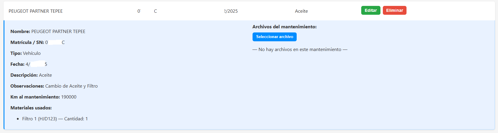
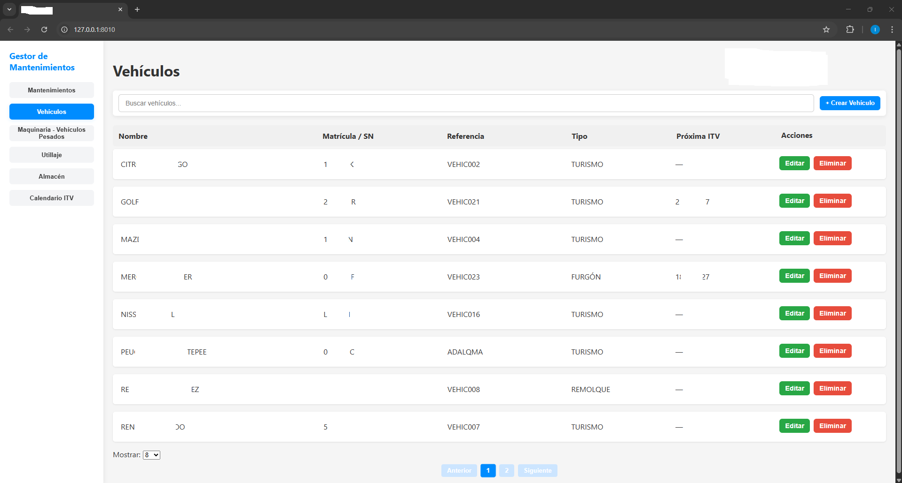
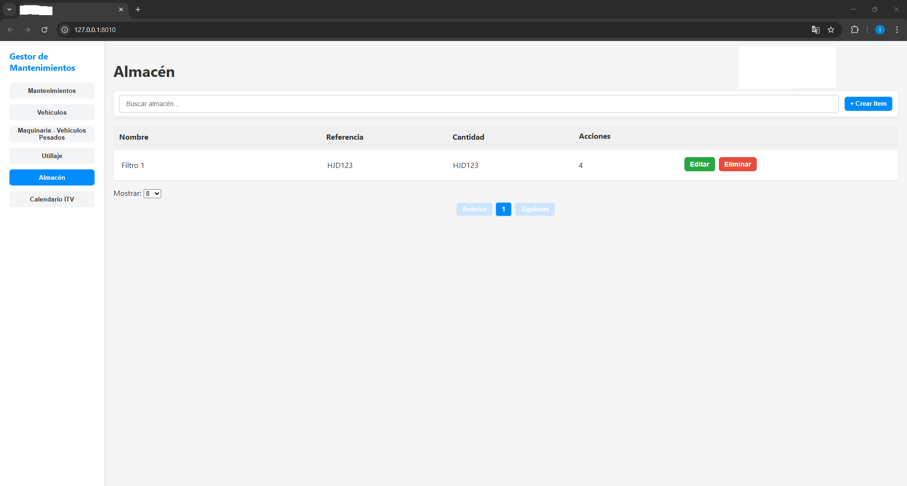

# Gestión de Mantenimientos y Stock

## Descripción
Aplicación web interna desarrollada con **FastAPI y React** para automatizar la gestión de ITVs, mantenimientos y control de stock. Base de datos centralizada para acceso multiusuario dentro de la oficina.

## Tecnologías utilizadas
- Backend: FastAPI  
- Frontend: React  
- Base de datos: SQLite  

## Capturas de pantalla

### Panel principal
  
Vista general con los datos de los mantenimientos creados. Permite editar y crear nuevos. Al crear un nuevo mantenimiento después de seleccionar el vehículo/maquinaria correspondiente ofrece una lista con los ítems enlazados a él. Esto permite controlar el stock.

### Vista expandida de mantenimientos
  
Vista expandida de un mantenimiento. Permite ver todos los datos del mismo, ver los ítems del almacén usados y subir documentos del mantenimiento/reparación si fuese necesario.

### Lista de vehículos
  
Lista de los vehículos registrados con sus datos. Si se expande se ven todos los datos oportunos como km actuales, km del último mantenimiento, etc. Lo mismo para vehículos pesados y maquinaria.

### Almacén
  
Lista con todos los ítems del almacén y su stock. Cada ítem está enlazado a los vehículos/maquinaria con los que es compatible.

## Beneficios
- Control de fechas de ITVs y mantenimientos  
- Control centralizado de stock  
- Mejora la planificación y reduce errores administrativos  

